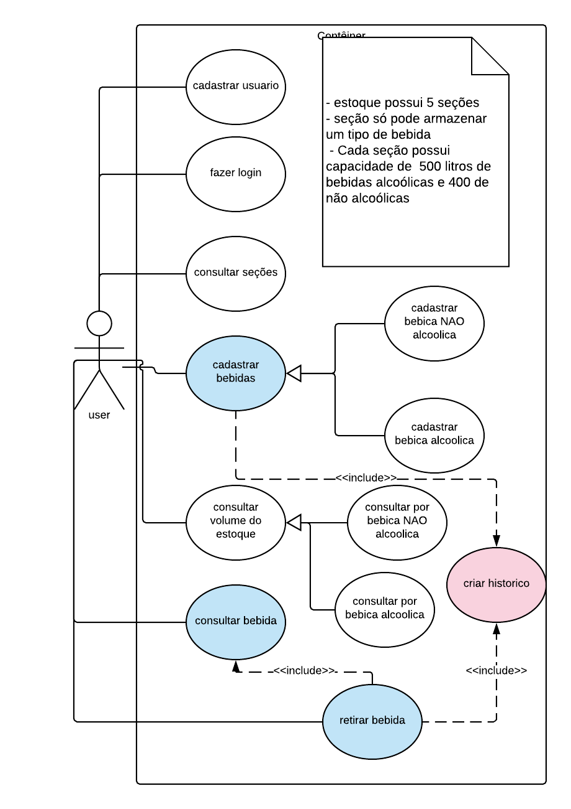
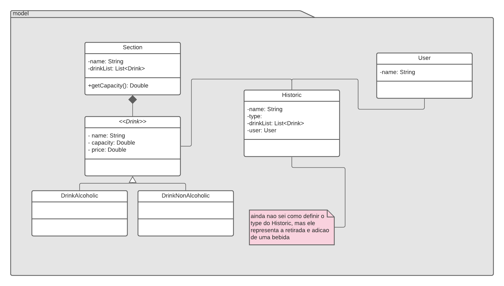
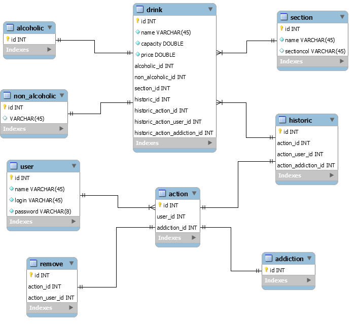

# DRINKS MANAGER API
	
*IMPORTANT! the system is in development fase*

## SUMARY

this project it is to manager a drink storage. Where a user can add a drink in a section
which will choose what kind of the drink (like alcoholic or not) it is.
Each kind of the drink it is storaged in a section, each section has a capacity.
the user can see the capacity of the each section.
Every operation (insert or remove) will be save in an historic.
This historic will contains the user login, the date and a list of drinks.

## INSPIRATION
this project was developed inspired by a job interview that I was participated.

## TECNOLOGY
To build this soluction I'm using Spring Boot to develop
an API and it has the following dependencies:

* Spring Web
* Spring Data JPA
* H2 Database
* Lombok

## SEE
To help me and you, I put some files which contains a few diagrams in the artefacts directory.
This diagram doesnt has a true representation of the system, it's just to show some notion 
about it

### Documento de Requisitos 
* [Requisits Documents](./artefact/diagram/documento_requisitos.pdf)

### Use case diagram
* 

### Class Diagram
* 

### Diagram EER
* 

## Contact

* **Elcio Cestari Taira** 
* *elciotaira@gmail.com*
* Whatsapp: *67 99146-1174*
